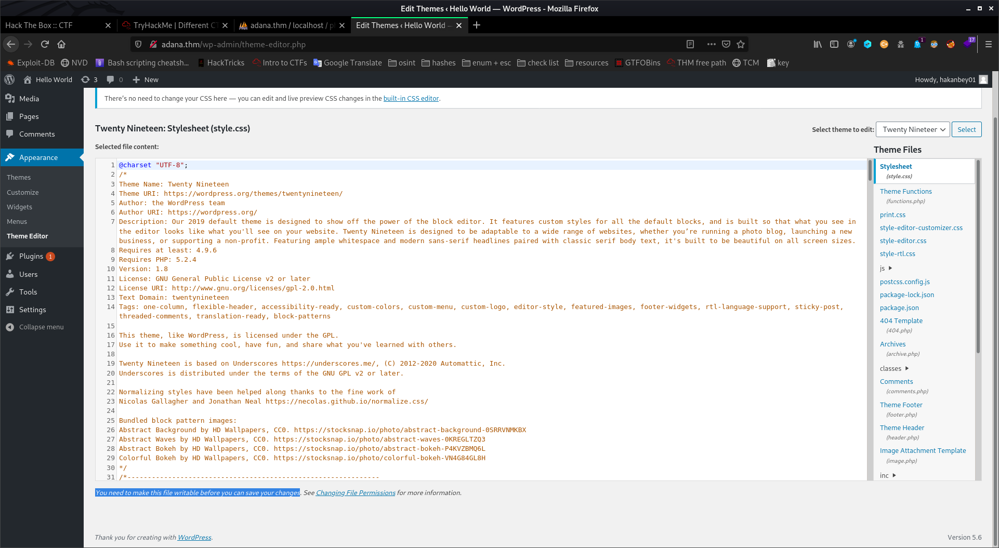

# different-ctf-writeup-tryhackme

this is a writeup for the tryhackme room "different ctf"
https://tryhackme.com/room/adana

1. First make sure you are connected to THM vpn and deploy the machine 

2. Enumeration
	"nmap -A -p- <ip>" shows that there's two open ports ftp and http 

	

	anonymous login is not allowed, so i fired up gobuster "gobuster dir -u http://<ip> -w /usr/share/wordlists/dirbuster/directory-list-lowercase-2.3-medium.txt"   and head to the webpage to see what's there

	seems a wordpress page and we notice the user "hakanbey01" 

	

	so i saved the username into a file called users.txt ( always remember to check the comments section cause they can contain useful information but in this case there's no comments )

	going back to see the the output of go buster there seems to be a phpmyadmin directory which we can try to brute force with the default username "phpmyadmin" but there's also an announcements directory so i head there and we find a picture with a .jpg extension and a wordlist ( that's sus right? )
	so i used stegcreacker which you can download using "apt install stegcracker" here's the link of the tool -> https://github.com/Paradoxis/StegCracker
	now i ran this command "stegcracker <name of the picture> <name of the wordlist you found>" and you'll get the hiddem file. catting that out reveales the ftp credentials -> hakanftp:[HIDDEN] so i went to see what's on the ftp and it seems to be the source code of wordpress website so i downloaded them all to search for useful information and one of the files is called "wp-config.php" so i started with that and found the credentials for the phpmyadmin so i logged in there

3. getting into phpmyadmin and wordpress
	once you login you can see there's two phpmyadmin panels one called "phpmyadmin" and another "phpmyadmin1" and they contain the exact same files 

	

	so my first thought was this maybe because one of them is the backup files for the site now i went to (phpmyadmin/wp_users ) section and found the user's hash. went to my terminal and copied that to a file named hash tried to crack it using john "john --wordlist=<the wordlist we found> hash" but i don't think the password is in the list so i went to the same section but in other panel (phpmyadmin1/wp_users ) and noticed that it's another hash i also copied that but this time john was able to crack it so i went the login page in wordpress now i have the username and the password but the password is incorrect knowing that means that this "phpmyadmin1" is the backup and "phpmyadmin" is the original page so i copied the hash from ( phpmyadmin1/wp_users ) to (phpmyadmin/wp_users ) so that now they are the same hash and i don't need to crack that hard one. now when i login again and it works but editing the 404 theme can't be done cause sadly we don't have write permission there. you can see that at the bottom of the pictre 

	
  
4. getting iniitial access
	so there's no point of getting into that wordpress. so i wanted to know where to find that backup so i ran ffuf to enumerate subdomains 
	( ffuf -u adana.thm -w /usr/share/wordlists/seclists/Discovery/DNS/subdomains-top1million-110000.txt -H "Host: FUZZ.adana.thm" ) and this did reveal a couple of subdomains but one of them is the backup indeed. there's also another way to find the subdomain by lookin in " wp-post "
	so i thought maybe i can upload a reverse shell through ftp and then run it from the browser and that's what i did but there's one thing left to do and it's to make the shell executable by running "chmod 777 shell.php" inside the ftp now i opened my listener "nc -lnvp <port>" and visited that website "<the subdomain you found>/adana.thm/shell.php" and i did get a reverse shell

5. escalating from www-data 
first you can make spawn a bash shell using "/usr/bin/script -qc /bin/bash /dev/null" 
now i catted the /etc/passwd file and found that there's 2 users ( hakanftp and hakanbey ) and we can login to hakanftp using the same password of the ftp that we found earlier i tried to search for SUID using this command "find / -perm -4000 2>/dev/null" but i got the error "permission denied" for using find cause it has this weird pemission "-rwxr-x--- 1 root hakanbey 238080 Nov  5  2017 /usr/bin/find" 
  
it's owned by root and members of the group hakanbey can execute it so we need to get to hakanbey first and i really got stuck at this point for two days evantually i tried the sucrack tool which you can download using "apt install sucrack" with the wordlist we found the syntax is "sucrack -u hakanbey wordlist.txt" but this didn't work
now looking at the 2 passwords we found earlier you notice that they start with the same prefix so that might be a pattern that hakanbey uses for his passwords so i prepended that word to every word in the wordlist.txt using this command "awk '{print "<the prefix>" $0}' wordlist.txt > list.txt " now the wordlist is perfect running sucrack again with the wordlist " list.txt " will work indeed and give you the password of the user (take note of his password cause we might re-use it later ) 

6. getting root 
  	now i know i can run the find command, looking for SUIDs again 

	

  	there's one called /usr/bin/binary that's interisting. let's see what it does "ltrace /usr/bin/binary" 

	

	it's asking for a string so i entered the first one from the options "warzone" then the function strcmp compares my string with "warzoneinadana" so that's the right string that we need to choose but i got kicked from the user hakanbey ( that's why i told you to keep note of the password ) so we login again and re-run the binary entering the correct string this time we get this output

	

there's a hint saying "Hexeditor 00000020" so we need to download that picture then run hexeditor and to look at line 00000020 we copy the hex line then decode it ( from hex and then to base85 ) and we got the root pass just type "su root" and walaa

	written by yanal abuseini
